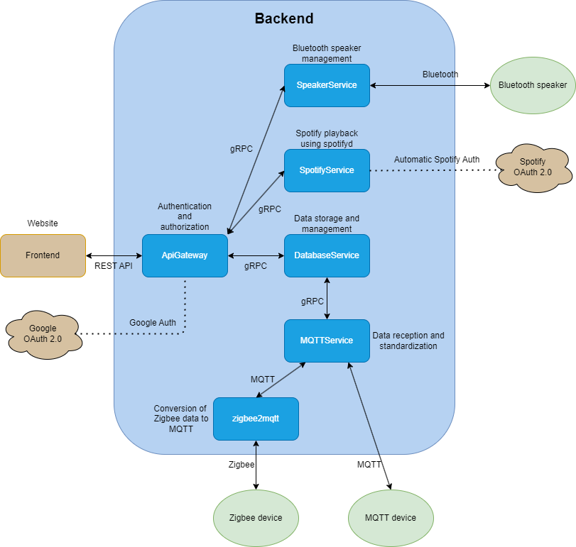

# HOME APP

## Target

A full stack application that allows its users to check and alter their home IoT capable devices. Currently using a Raspberry PI 4 as server and Zigbee capable devices for measurements. More features are to be added later.

## Used technologies

The frontend is a website using ReactJS.
The backend is written in .NET 6.
The communication between them is currently a REST API that uses authentication and authorization (currently accepting Google OAuth 2.0 and first party sign in, more options are under development).

The Zigbee devices send data to a zigbee2mqtt bridge that transforms the data into MQTT. Therefore, it is also possible to use MQTT devices with this configuration.

The rest of the microservices use gRPC with Protobuf for communication between each other -  currently set up for local environments only.

It is possible to use IoT devices that are outside the local area network, as the REST API provides endpoints for this scenario too. Due to security concerns, these devices must authenticate and authorzize themselves.

## Architecture



## Getting started

**How to install and run the project?**

For the backend:   
- make sure .NET 6 is installed, the project should run both on Linux and Windows
- set the environment variables JWT_SIGNING_KEY, CLIENT_ID, CLIENT_SECRET. The CLIENT_ID and CLIENT_SECRET should be available through the project's Google Cloud page. (If you have no access to the page, please create a new project, set it up with your domain and alter the addresses used in the project to the ones you have both in Google Cloud and the repository. In Google Cloud you should create an OAuth 2.0 Client ID if you want to use the google sign-in option.)
- Run 

    ```
    dotnet build
    ```
    then
    ```
    dotnet run
    ```
    for all microservices.

    For example from the ```ApiGateway/ApiGateway``` folder

For the frontend:
- Run
    ```
    npm install
    ```
    and then
    ```
    npm run
    ```
    from the Frontend/homeapp directory

For zigbee2mqtt:
- Run
    ```
    docker compose up -d  
    ```
    from the zigbee2mqtt folder.

NGINX (Linux) :
- To make the backend and frontend run properly without having to use ports explicity, NGINX has been set up to re-route the incoming requests. To set up nginx via APT run the ```sudo apt install nginx``` command. If you use other package managers, please check how NGINX can be installed. After installing, two rules have to be set up in the /etc/nginx/sites-available/default file. You can use your own files as well, but for simple projects like this, the default file should be good enough. There is an example configuration for it [here](Nginx/sites-available/default).
 - Make sure to remove the default ```location /``` value too.
 - After making the changes link the file to NGINX via:
    ```
    sudo ln -s /etc/nginx/sites-available/default /etc/nginx/sites-enabled/
    ```
    and restart NGINX with the command:
    ```
    sudo service nginx restart
    ```

Database:
- The project uses MySQL (MariaDB) to store data, the databases are called the same as the microservices using them, but with lowercase letters (The name and credentials of the databases for a project can be found under its ```appsettings.json```). Every project has a reset SQL script under its SQL folder. On Linux MySQL can be downloaded via ```sudo apt install mysql-server```. Then it can be accessed via ```sudo mysql```. Make sure to set up a user (currently "root") and a password (currently "rootpassword") and add the databases. Then, to access it you can run ```sudo mysql -u root -p```. After entering the password "rootpassword" run ```use <database name>``` to select a database.

If everything is done properly you should be able to use the project.


